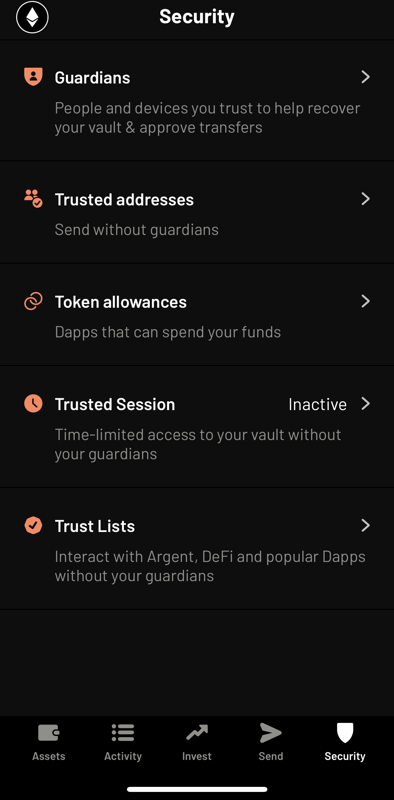
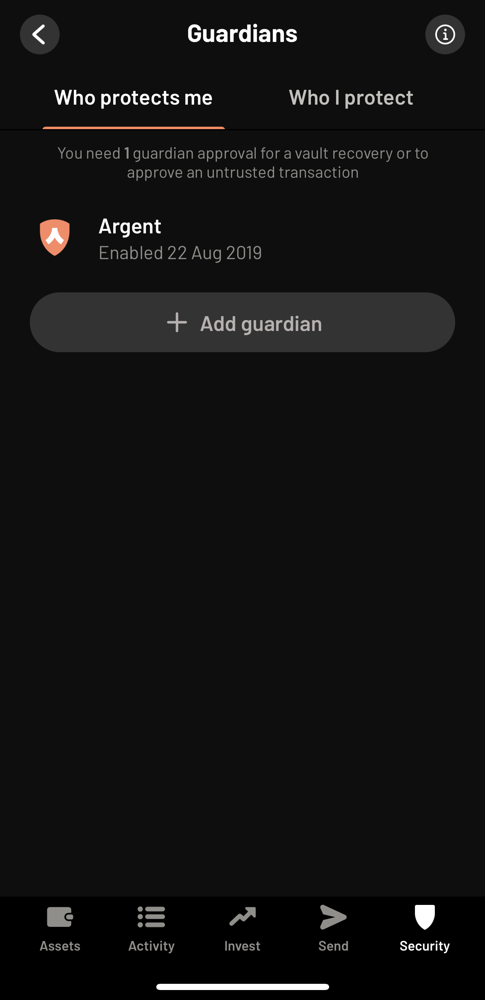

# 3. How to protect yourself

## Passwords

**Use a password manager** - passwords are the primary line of protection of most accounts. Using a password manager is the best way to generate and keep track of long random string passwords, usernames and URLs for websites. They also make life much easier.

It is advisable to split your passwords based on threat for example use Keepass XC stored locally and offline for high importance passwords and Bitwarden browser based manager for day-to-day usage on lower importance passwords

[**KeepassXC**](https://keepassxc.org/)

* probably the most secure option
* open source
* keeps a local database that can be synced across devices if needed (Syncthing, Drive, Dropbox etc.)
* fine control over the encryption
* can use a [Yubikey](https://www.yubico.com/) as a second factor authentication or a keyfile that needs to be present along with the password, this could be any file such as a picture to not be obvious.
* not as convenient with browsers or across devices

[**Bitwarden**](https://bitwarden.com/)

* open source
* browser based
* good for syncing across devices
* can be self hosted otherwise hosted by them
* 2FA can be required for setting up on a new device

**Password strength** 

The longer and more random the better which is why it is best to use a password manager to generate although some services will not support all character types and have limits to how many characters you can use

**Passphrases**

There are always passwords that will need to be memorable - the password to your password manager for example - so how should you pick a secure password?

Using your password manager to randomly generate a passphrase is a good way and then [memorising a story using the linking method](https://www.mind-expanding-techniques.net/memory-strategies-how-to-improve-your-memory/linking-method/) to tie them together. You could also come up with your own random sentence, don't use use a quote from a book or movie.

## Usernames & email addresses

Just like using unique passwords dramatically increases your security so do unique usernames. Bitwarden has a random username generator built in. In cases where email is your username you can have a catch-all address if you own your own domain with some email providers for example.

you own the domain gerbilpoo.com, you can have the email dave@gerbilpoo.com and use a catch-all of that email address such as github44312@dave.gerbilpoo.com

"github" can make it easier for you to know what service the username is for "44312" is random so that an attacker cant guess that your amazon password is amazon@dave.gerbilpoo.com.

Gmail has an option for dave@gmail.com to use + after the username and add unique addresses such as dave+github44312@gmail.com with the same principles as above.

Apple also has a service that does a similar thing with a service called [hide my email](https://support.apple.com/en-gb/guide/iphone/iphf277f837e/15.0/ios/15.0) whereby it creates randomly generated email addresses such as T$lDa9Mpp&&1E%2g6O4@icloud.com.

## 2FA (Two Factor Authentication)

Adding 2FA to an account is on of the most effective ways of increasing the security on an account. Having a second authentication requirement makes it much more difficult for someone to gain access to an account because even if they have your username and password they will still be gated.

Recommendation would be use a Yubikey where you can and Authenticator app everywhere else.

**Phone based 2FA**

Should be avoided as it is vulnerable to [sim swapping attacks](1.-how-crypto-gets-lost-or-stolen.md#sim-swapping).

**Yubikey or alternative hardware authentication devices**

These offer a physical (typically USB device that you plug in to your computer and press a button to authenticate.

Yubikeys are incredibly versatile, they support a wide range of 2FA standards. They can even be used to replace passwords.

Typically it is worth having multiple Yubikeys. when you set one up with an account set up the others too so there are spares incase you lose one. It is worth noting that sometimes you cannot register a hardware authentication device until you have setup an authenticator app.

An additional device can be the newer Macbooks with their T2 security chip where the fingerprint scanner can be used as authentication.

.png>)

**Authenticator apps / TOTP (time-based one time password)**

There are many of these apps you would typically have on your phone and generate a numeric passcode that changes every minute. I would recommend open source and one that allows you to export keys to a new device otherwise it becomes a nightmare when changing phones. Also good practice would be to have them set them up on multiple devices for redundancy.

Recommendations are OTP Auth (IOS), Aegis (Android), Authy (multi platform, not open source) but  most will do the job.

## Seed management

A seed is the key to most forms of wallet and must be guarded at all costs. NEVER, NEVER put your seed into a website asking for it. Don't share it with others, Anyone who has your seed also has full control of each account associated with that seed.

**Safe deposit boxes** 

These are a great option for keeping a safe backup of your seeds [see thread by Erick / Snowfro](https://twitter.com/ArtOnBlockchain/status/1545064027390361602?s=20&t=6e5esROGVVzVfpEES8hbvQ). It is worth considering that you don't want a person at the bank (or anyone else) to be able to access your full plain text seed. One option is to keep a spare hardware wallet (or two) in your safe deposit box, you could increase redundancy by using two different banks. Another option is to have your seed in plain text but split it between deposit boxes at different banks. Another option would be to have an encrypted USB stick (or two).

**Encrypted USB sticks / memory cards**

Storing your seedphrase in digital form is a contentious subject. Some are of the opinion that it should never be done, while others think that with caution and good practice you can build a resilient and far richer backup of your important information. For example you can include the following:

* multiple seedphrases
* password manager backups
* separate private keys
* guides and supporting documents

It is very important that you have multiple versions of an encrypted device as USB sticks and memory cards are prone to failure over time.

One of the biggest attack vectors is plugging into a computer that has been compromised. To mitigate this it is recommended that you have a completely separate offline computer that never touches the internet or better still has had its wifi and bluetooth units removed.

If you dont have free computer for this usecase you could use a bootable USB linux installer such as Ubuntu which you can boot directly into from a PC or laptop. Better yet you could use [Tails, which is a privacy focussed amnesic OS that you can also boot from a USB stick](https://tails.boum.org/).

## Wallets

**HD Wallets (Hierarchical Deterministic Wallets)**

These are the most common wallets in Crypto

**Multi-signature Wallets**

Muti-sig wallets can be an excellent option for certain use cases. [Gnosis Safe](https://gnosis-safe.io/) is a good product for creating single or multiple user wallets on a number of blockchains and have a top security track record. They can also be used for [recurring payments to multiple parties](https://twitter.com/niftytime/status/1415391519205298177?s=20&t=RZKI96fZ8n0GZUauqy0W0w). 

**Social recovery wallets**

[Argent wallet](https://www.argent.xyz/) are probably the most popular example of social recovery wallets through its IOS and Android wallets with excellent security and ease of use. You can authenticate yourself with a phone number and have email 2fa. There are many options such as self imposed limits on spend or to certain addresses without extra authentication using the guardian system.

## Backups

## OPSEC (Operational Security)

## VPNs

## Phone

[GrapheneOS](https://grapheneos.org/)

[CalyxOS](https://calyxos.org/) 

[Google Advanced Protection](https://landing.google.com/advancedprotection/)

[Apple Lockdown Mode](https://www.pocket-lint.com/phones/news/apple/161801-apple-iphone-14-launch-tipped-for-13-september)

## Mindset

## Redflags

## Actions to take now
