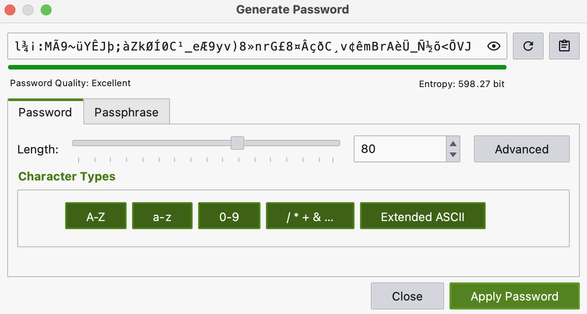
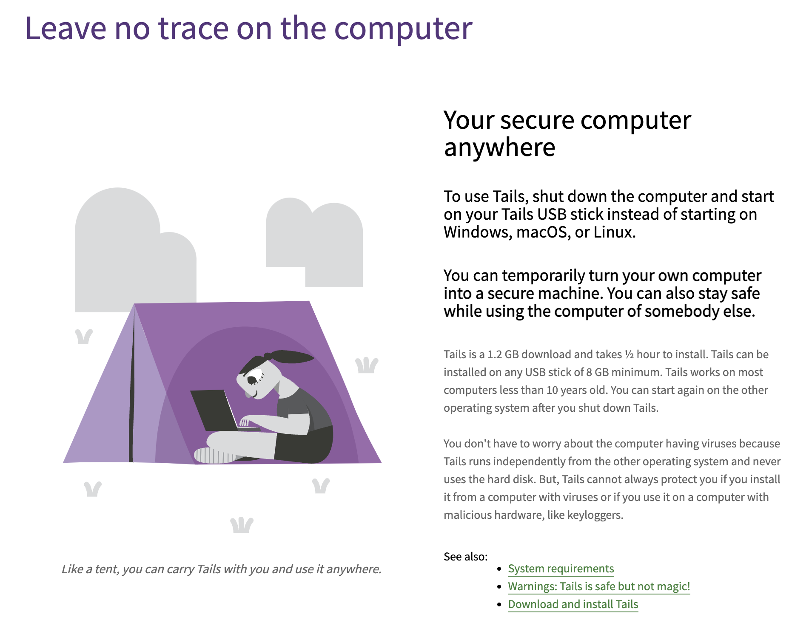
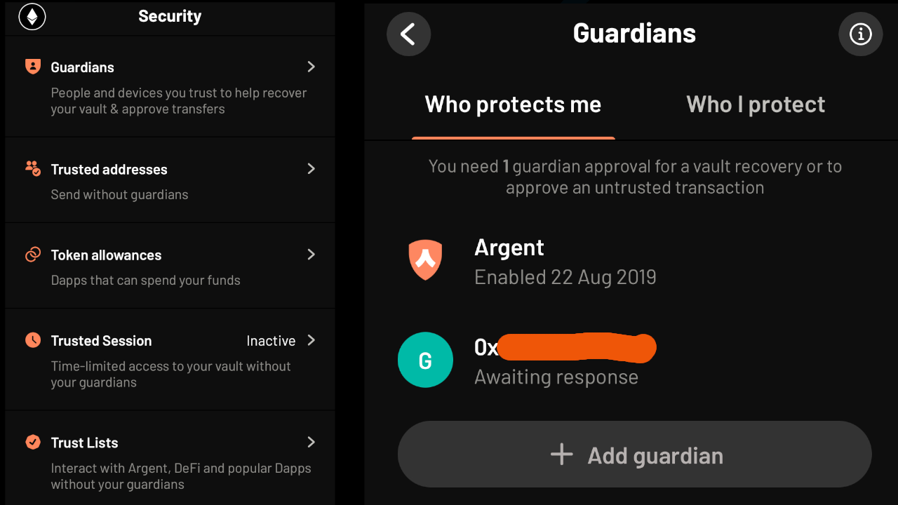

# Contents
1. [Introduction](#1-introduction)
2. [How crypto gets lost and stolen](#2-how-crypto-gets-lost-and-stolen)
   - [Phishing links](#phishing-links)
   - [Malicious files](#malicious-files)
   - [Data breeches](#data-breaches)
   - [Sim swapping](#sim-swapping)
   - [Social engineering](#social-engineering)
   - [Loss of seeds / passwords](#loss-of-seeds--passwords)
   - [Sending to the wrong address](#sending-to-the-wrong-address)
   - [Approval scams](#approval-scams)
   - [Intercepted communications](#intercepted-communications)
   - [Physical theft](#physical-theft)
3. [How to protect yourself](#3-how-to-protect-yourself)
   - [Passwords](#passwords)
     - [Password strength](#Password-strength)
     - [Passphrases](#Passphrases)
   - [Usernames & email addresses](#usernames-&-email-addresses)
   - [MFA (Multi Factor Authentication](#mfa-multi-factor-authentication)
     - [Phone based MFA](#phone-based-mfa)
     - [Hardware MFA devices](#hardware-mfa-devices)
     - [Authenticator apps](#authenticator-apps)
   - [Mnemonic seed management](#mnemonic-seed-management)
     - [Safe deposit boxes](#safe-deposit-boxes)
     - [Encrypted USB sticks / memory cards](#encrypted-usb-sticks--memory-cards)
     - [Paper storage (cyphered)](#paper-storage-cyphered)
   - [Wallets](#wallets)
     - [Standard software wallets](#standard-software-wallets)
     - [Multi-signature wallets](#multi-signature-wallets)
     - [Social recovery wallets](#social-recovery-wallets)
     - [Migrating from software wallet to hardwarewallet](#migrating-from-software-wallet-to-hardware-wallet)
   - [Token approvals](#token-approvals)
   - [Backups](#backups)
   - [VPNs](#vpns)
   - [Phone Operating System (OS)](#phone-operating-system-os)
   - [Redflags](#redflags)
   - [OPSEC (Operational Security](#opsec-operational-security)
4. [To conclude](#to-conclude)
   - [Actions to take now](#actions-to-take-now)
   - [Further learning](#further-learning)

# 1. Introduction
Welcome to the Gerbils Security Guide for Crypto & NFTs

We are writing this guide as a resource to help the community protect themselves against loss of their digital assets. This threat comes in the form of a consistent and unrelenting army of attackers looking to exploit any vulnerability software or human. This threat also comes in the form of personal loss through incomplete backup solutions or protocol when transferring assets.

We will also take a look at secure strategies to pass on your estate in case of unexpected death or emergency.

We invite the community to get involved and add to/correct this resource where you feel you can add value or experience.

# 2. How crypto gets lost and stolen

## **Phishing links**

These can be in the form of links sent through Email, Discord, Twitter ([example phish attempt](https://twitter.com/BelloneLeandro/status/1542469086491418626?s=20&t=VIuuyw8K9Um6uDpZRDJH8Q)) and typically take you to a malicious website, which can either be a clone or a legitimate website which asks for information such as passwords or seed phrases or a website with malicious code that can deliver a virus to your computer / phone.

To reduce the chances of this happening to you requires mindset and following best practices.

## **Malicious files**

Opening malicious files sent to you that contain some malware/virus to compromise your device. Typically these would be executable files but they can also be a document, spreadsheet or executables such as SCR saved to look like a PDF such as in this tweet [such as in this tweet](https://twitter.com/Serpent/status/1540770171069276160?s=20&t=QDjjWRGWigvRcwYbmJ2Tgg).

## **Data breaches**

Data breaches happen daily, it is best to assume that any content you put on the internet through a service or site will eventually be leaked through a data breach. Leaked data can include email, usernames, passwords, address, credit card / bank details, IP address, pictures and much more, in fact anything a service has relating to you.

If your use one email and password for multiple sites and one of them leaks those credentials then there people that run bots to scrape this info and try the same credentials on other sites.

According Verizon's [2022 Data Breach Investigations Report](https://www.verizon.com/business/resources/reports/dbir/) 81% of data breaches are caused by weak, and reused passwords, which as we know leads to more data breaches... break the cycle.

Correct [password management](#passwords) and hygiene can help prevent this. Add a different username / email for each service and protection is increased.

## **Sim swapping**

This is porting someone's phone number to another sim card to take control of their number. Once they have this an attacker can reset the passwords to your email, from your email they can search to see which services you use and take control of those. Importantly this can mean crypto exchanges and banks.

In addition if they have access to your email they might also have access to your google drive, dropbox, icloud and be able to scrape through and take anything they like such as backups of passwords and seed phrases or personal photos.

[MFA (Multi Factor Authentication)](#mfa-multi-factor-authentication) and [OPSEC (Operational Security)](#opsec-operational-security) can help defend against this.

## **Social engineering**

This is a broad category that can include collecting information on someone to then impersonate them for a sim swapping attack or it could be as simple as impersonating a friend or colleague on discord and asking to send funds over.

Social engineering is also used to befriend people and gather information about them over time. as the victim begins to trust the attacker they might divulge information such as where they live, share photos with detailed metadata, email addresses, habits, practices and other personal details that can then be used in an attack.

Below is an example of an email that came with a red flag that could be easily missed, the email domain resembles but does NOT match the domain of the company they are claiming to represent. This is probably a social engineering attack that would result in them seding over a resource with malware for the recipient to open.

## Loss of seeds / passwords

Sometimes you are your own worst enemy, relying on a single computer / phone / USB stick / piece of paper to store your passwords & seed phrases can easily result in loss.

[Backups](#backups) and redundancy are very important.

## Sending to the wrong address

Self custodianship is a responsibility that needs to be thought through carefully. Unfortunately through mis-understanding or carelessness it can be easy to send NFTs to the wrong address. It could be someone else's wallet, a contract that is not designed to receive that asset or even the wrong blockchain.

Crypto analytics firm [Glassnode estimate 3 million Bitcoin are lost forever](https://insights.glassnode.com/bitcoin-liquid-supply/).

## Approval scams

[inadvertently approving the transfer of all your tokens to a smart contract](https://medium.com/mycrypto/bad-actors-abusing-erc20-approval-to-steal-your-tokens-c0407b7f7c7c). It is very important to pay attention to what you are signing with your metamask.&#x20;

## Intercepted communications

Intercepted comms can happen through using open or public WiFi, a simple example of this can be an attacker impersonating the wifi at your local cafe, you connect to their wifi and check your email. They can then serve you a fake website and capture your login credentials.

This is where [VPNs](#vpns) become an important tool.

## Physical theft

Physical attacks happen when people known to have a large amount of crypto are targeted, often at their homes. This can involve weapons and holding family members hostage highlighting the importance of good [OPSEC](#opsec-operational-security).

# 3. How to protect yourself

## Passwords

**Use a password manager** - passwords are the primary line of protection of most accounts. Using a password manager is the best way to generate and keep track of long random string passwords, usernames and URLs for websites. They can also check the URL for a site is correct and they generally make life much easier.

It is advisable to split your passwords based on threat for example use Keepass XC stored locally and offline for high importance passwords and Bitwarden browser-based manager for day-to-day usage.

[**KeepassXC**](https://keepassxc.org/)

* probably the most secure option
* open source
* keeps a local database that can be synced across devices if needed (Syncthing, Drive, Dropbox etc.)
* fine control over the encryption
* can use a [Yubikey](https://www.yubico.com/) as a second factor authentication or a keyfile that needs to be present along with the password, this could be any file such as a picture to not be obvious.
* not as convenient with browsers or across devices

[**Bitwarden**](https://bitwarden.com/)

* open source
* browser based
* good for syncing across devices
* can be self hosted otherwise hosted by them
* 2FA can be required for setting up on a new device

### Password strength 

The longer and more random the better, which is why it is best to use a password manager to generate passwords. Note that some services will not support all character types and have limits on how many characters you can use.

### Passphrases

There are always passwords that will need to be memorable - the password to your password manager for example - so how should you pick a secure password?

Using your password manager to randomly generate a passphrase is a good way and then [memorising a story using the linking method](https://www.mind-expanding-techniques.net/memory-strategies-how-to-improve-your-memory/linking-method/) to tie them together. You could also come up with your own random sentence but don't use song lyrics or quotes from a books / movies.

## Usernames & email addresses

Just like using unique passwords dramatically increases your security, so do unique usernames. Bitwarden has a random username generator built in. In cases where email is your username you can have a catch-all address if you own your own domain which will allow your to have a different email address for each service.

[Simplelogin](https://simplelogin.io/) I think offers one of the best services for this. You can import your own domain names make them catch-all. For example you can have the domain name **gerbilpoo.com** and accept email to **<i>coinbase1436</i>@gerbilpoo.com**, **<i>5578github</i>@gerbilpoo.com** and a unique email for every account that get forwarded on to your primary email address(s). The very unique feature of Simplelogin is you can reply to any email that gets gets forwarded to your primay email and the reply gets re-routed through a unique email and then sent from the original alias email. Making it seem like a primary email address and hiding all remnants of your primary email.

> The random numbers in **<i>coinbase1436</i>@gerbilpoo.com** is to make it unguessable in case of username and password leaks and patterns being put together for a targeted attack.

**Domain names** - It is good to use your own domain name so that if you need to change email provider/forwarder for any reason you can take your email addresses with you.

 > avoid domain names ending in .xyz as these often get routed straight into peoples spam folders by many email services. This may be true of other exotic domains but I haven't tested. I would advise sticking with older well established ones.

For low importance services such as newsletters or online purchases you can use a randomly generated alias on the simplelogin.com domains which increases privacy but reduces personal redundancy. If you don't use Simple login there are other services that offer burner aliases such as [33mail](https://33mail.com/). 

Apple also has a service that does a similar thing with a service called [hide my email](https://support.apple.com/en-gb/guide/iphone/iphf277f837e/15.0/ios/15.0) whereby it creates randomly generated email addresses such as T$lDa9Mpp&&1E2g6O4@icloud.com. The downside to this service means you are tied to Apple as you can't do this with a custom domain name.

## MFA (Multi Factor Authentication)

Adding 2FA to an account is on of the most effective ways of increasing the security on an account. Having a second authentication requirement makes it much more difficult for someone to gain access to an account because even if they have your username and password they will still be gated. My recommendation would be use a Yubikey where you can and Authenticator app everywhere else.

### Phone based MFA

Should be avoided as it is vulnerable to [sim swapping attacks](sim-swapping).

### Hardware MFA devices

These offer a physical (typically USB device that you plug in to your computer and press a button to authenticate. Yubikeys are the most well-known and are incredibly versatile, they support a wide range of standards and they can also be used to replace passwords.

>It is worth having multiple Yubikeys. when you set one up with an account set up the others too so there are spares incase you lose one. It is worth noting that sometimes you cannot register a hardware authentication device until you have setup an authenticator app.

Some Apple Macbooks with the T2 security chip can use fingerprint scanner as hardware authentication with many services. Google pixel phones can also be used as an MFA device using their [Titan M chips](https://www.theverge.com/2019/4/10/18295348/google-android-phone-fido-webauthn-phishing-two-factor-authentication).

.png>)

### Authenticator apps

There are many of these apps you would typically have on your phone that generate a mew numeric passcode that changes every minute. I would recommend open source and one that allows you to export keys to a new device otherwise it becomes a nightmare when changing phones. Also good practice would be to have them set them up on multiple devices for redundancy.

Recommendations are OTP Auth (IOS), Aegis (Android), Authy (multi platform, not open source) but  most will do the job.

## Mnemonic seed management

A seed is the key to most forms of wallet and must be guarded at all costs. NEVER, NEVER put your seed into a website asking for it. Don't share it with others and dont screenshot it and upload to the cloud. Anyone who has your seed also has full control of each account associated with that seed. Here we cover some of the options for keeping your mnemonic seed phrase safe and later we will look at strategies for implementing these.

### Safe deposit boxes

These are a great option for keeping a safe backup of your seeds (see [thread by Erick / Snowfro](https://twitter.com/ArtOnBlockchain/status/1545064027390361602?s=20&t=6e5esROGVVzVfpEES8hbvQ)). It is worth considering that you don't want a person at the bank (or anyone else) to be able to access your full plain text seed. One option is to keep a spare hardware wallet (or two) in your safe deposit box, you could increase redundancy by using two different banks. Another option is to have your seed in plain text but split it between deposit boxes at different banks. Another option would be to have an encrypted USB stick (or two).

### Encrypted USB sticks / memory cards

Storing your seedphrase in digital form is a contentious subject. Some are of the opinion that it should never be done, while others think that with caution and good practice you can build a resilient and far richer backup of your important information. For example you can include the following:

* multiple seedphrases
* password manager backups
* separate private keys
* guides and supporting documents

>It is very important that you have multiple versions of an encrypted device as USB sticks and memory cards are prone to failure over time.

One of the biggest attack vectors is plugging into a computer that has been compromised. To mitigate this it is recommended that you have a completely separate offline computer that never touches the internet or better still has had its WiFi and bluetooth units removed.

If you dont have free computer for this usecase you could use a bootable USB Linux installer such as Ubuntu which you can boot directly into from a PC or laptop. Better yet you could use [Tails, which is a privacy focussed amnesic OS that you can also boot from a USB stick](https://tails.boum.org/).

### Paper storage (cyphered)

[In a recent Twitter post](https://twitter.com/kaigani/status/1553435891091116032?s=20&t=6HzLqGqXUSF1FzdkQH2GDA) Kaigani laid out a wonderful method to store your seed on paper but in a ciphered way to add security.
>You'll need:
>
>* 64 index cards
>* a way to randomize passphrases
>* a way to randomize words from the dictionary
>
>1. write 4 normal words on 4 index cards (ideally in a sequence that is meaningful to you but not obvious)
>2. On the back, write each 3 of the 12 passphrase words on the 4 cards in order
>3. continue to write random dictionary words on the front and 3 valid passphrase words on the back for the remaining 60 cards
>4. Shuffle the cards
>
>Picking out the right cards, in the right order should be something easy for you to do, but nearly impossible for anyone else"

## Wallets

### Standard software wallets

These are the most common wallets in Crypto which use a mnemonic seed phrase, which is a human readable root key to generate numerous key pairs. [Metamask](https://metamask.io/) is an example of a standard browser-based wallet.

>A key pair consists of a public and private key, the public key in this context acts as a public address for an account to receive crypto & tokens and the private key is used to control the account. It is a form of [public key cryptography](https://en.wikipedia.org/wiki/Public-key_cryptography) and is the root of safety on the internet!

### Multi-signature wallets

Muti-sig wallets can be an excellent option for certain use cases. [Gnosis Safe](https://gnosis-safe.io/) is a good product for creating single or multiple user wallets on a number of blockchains and have a top security track record. They can also be used for [recurring payments to multiple parties](https://twitter.com/niftytime/status/1415391519205298177?s=20&t=RZKI96fZ8n0GZUauqy0W0w). 

### Hardware wallets 

These are small physical devices that store your seed in a high security chip and require physical sign-off on transactions. Hardware wallets are generally recognised as the industry standard for personl seed security.

>I would recommend setting up two devices with the same seed for redundancy and there are a few notes to ensure safety:

* When purchasing always buy direct from the manufacturer.
* They will NEVER come with a preinstalled seed, some attacks have come with the seed phrase already filled in. Always generate your own on the device.
* Use the official software on your computer to verify the firmware and keep the firmware updated.
* Verify the transaction you are doing on the screen of the device is correct and not just on your computer / phone.
* If anything unusual happens such as [screen turning off during a transaction](https://blog.kraken.com/post/5590/kraken-security-labs-supply-chain-attacks-against-ledger-nano-x/) don't ignore it.
* Ledger devices could be preferred to Trezor because the latter has been subject to [critical flaws in the past](https://blog.kraken.com/post/3662/kraken-identifies-critical-flaw-in-trezor-hardware-wallets/).
* It has also been suggested to use the fastest shipping possible to reduce the chance of a supply chain attack.

### Social recovery wallets

[Argent wallet](https://www.argent.xyz/) is probably the most popular example of social recovery wallets through its IOS and Android wallets with excellent security and ease of use. You can authenticate yourself with a phone number and have email 2fa. There are many options such as self imposed limits on spend or to certain addresses without extra authentication using the guardian system.

Vitalik Buterin wrote the article [Why we need wide adoption of social recovery wallets](https://vitalik.ca/general/2021/01/11/recovery.html) putting forth the argument for why social recovery is better than multi-sig and hardware wallets and mnemonic seed phrases

### Migrating from software wallet to hardware wallet

If you setup a software wallet, collected hundreds or thousands of NFTs and it is prohibitively expensive to transfer your NFTs to a new hardware wallet a better option to leaving them where they are is to import that seed to a hardware wallet and remove the seed from all previous wallets.

This should only be done if it prohibitively expensive to just move the NFTs, which can otherwise be done in batches on Opensea by bundling upto 50 NFTs together. It is worth noting that although batched items transfer in one transaction the compute on the blockchain is still the same so gas will be similar to sending each one separately.

## Token approvals

It is good practice to revoke un-necessary token approvals when they are no longer needed as over time you can leave your wallets exposed to un-necessary risk.
This can easily be done via [Etherscan](https://etherscan.io/tokenapprovalchecker) or [Revoke.cash](https://revoke.cash/).

## Backups

Always make sure there are multiple instances each seephrase and infact everything important. Make sure there is no single point of failure. 

If your house burns down, will it take out all copies of your seedphrase? If so then it is not sufficiently backed up.

Scenarios to acccount for are:
* Death - if you die, will the right person(s) be able to decipher your security?
* Fire - are all copies kept in the same place?
* Theft - if your safe or the deposit box at the bank gets stolen is that the only copy?
* Data decay - [when your disks, drives and keys break or corrupt](https://www.howtogeek.com/660727/bit-rot-how-hard-drives-and-ssds-die-over-time/), will you lose everything? Keep multiple versions and have a method for checking for corruption before backing up and keep both digital and physical copies.

## VPNs (Virtual Private Networks)

VPNs are a good option to stop exposure of your home IP address to websites and services. They can also reduce some online tracking but the majority of that is done [through cookies and other means](https://www.makeuseof.com/vpn-website-tracking/).

## Phone Operating System (OS)

Your phone and the system it runs can make a big difference to security. There is too much to dive in deep here but we can provide some key points and resources:

* Stock Android on a Pixel phone will provide the best security but not privacy
* Most other Andoid providers such as Samsung will offer reduced security and privacy, through delayed security updates and an extra layer of data harvesting
* Iphone with iOS provides generally good security and privacy, both are improved dramatically by not using icloud.
* There are some custom operating systems that increase security and privacy. [GrapheneOS](https://grapheneos.org/) is de-googled with a custom hardened kernel that sandboxes each apps memory and storage. The tradeoff is usability is reduced without Google services and requires commitment to de-googling to make work. [CalyxOS](https://calyxos.org/) is degoogled android but with an open source version of google services, it doesn't have the security hardening of Graphene but does have increased privacy over stock Android.

Google offer [Google Advanced Protection](https://landing.google.com/advancedprotection/) to increase security and is recommended for Google Android users who use crypto and NFTs
Apple have a similar feature coming soon with [Apple Lockdown Mode](https://www.pocket-lint.com/phones/news/apple/161801-apple-iphone-14-launch-tipped-for-13-september).

Interestingly [The Hated One on Youtube puts forward a compelling case](https://youtu.be/Wd4Pa03LvLk) for why phones are more secure than computers contrary to popular opinion.

## Redflags

* All unexpected app, website or file behaviour
* Feeling rushed - never feel rushed to make a decision this is often used to get people to make bad decisions. Humans are easily hackable and a feeling of panic can override rationality.
* Any email, phonecall, message etc. annoyncing your wallet, account or passwords have been compromised and need urgen attention (do not click any links).
* Email domains that doesnt fully match company (website) domain eg. opensea.io vs opensea.com or openseaio.com or theopensea.io
* ALL unsolicited emails and private messages should be treated with great caution
* New online friends wanting to send you files (documents, images, video, slideshow, pitch decks). If you want to open them do it in a [virtual machine](https://www.vmware.com/topics/glossary/content/virtual-machine.html) or [Amazon Workspaces](https://clients.amazonworkspaces.com/)
* Anyone or thing asking for your seedphrase.

## OPSEC (Operational Security)

OPSEC is the process of protecting your personal and online security by maintaining good online practices and not giving out unnecessary data about yourself. It can be the practice of masking these details or even putting out dummy data. Some simple suggestions are:

* Use different email addresses for difference services with [Simplelogin](https://simplelogin.io).
* Have an alternative phone number(s) for important services
* Use encryption wherever possible
* Don't rely on a single party for everything. [Google will happily shutdown your account](https://nypost.com/2022/08/22/google-bans-dad-for-sending-pics-of-toddlers-swollen-genitals-to-doctor/) and refuse to reinstate it after it is clear there was a misunderstanding.
* Have a virtual machine or Amazon Workspace ready for any links or files that you have slight suspicion over but do want/need to open.
* Protect your home address! (this is not something you want floating around on the Internet)
* Protect your real name. This doesnt apply to everyone but it is advisable to go by an alias online unless absolutely necessary.
* In extreme cases you may wish to setup a forwarding address or PO BOX for mail and own assets such as your house and car under a company name.

# 4. To conclude

There is no such thing as perfect security, however, the more layers you can add to your security 'onion' the better protection your core will have. We hope you gain some implementable ideas and strategies from this guide to help protect your assets.

## Actions to take now

* If you don't have a password manager - get one NOW
* Audit your passwords, replace any reused ones
* Revoke token Approvals
* Refresh / create backups
* Write a guide for your next of kin
* Make and execute a strategy to pass on your digital assets
* Develop a security mindset, keep in mind and asess your behaviours and habits and think about the way they might expose you to harm online
* Go back through this guide and see if you can improve your own setup and practices

## Further learning

* [NonFunGerbils interview with Tagachi](https://nonfungerbils.com/podcast/41-tagachi-wallet-security) - on wallet security best practice
* [Privacty Security and OSINT Podcast](https://www.inteltechniques.com/podcast.html) - a massive collection of in depth and useful resources
* [Andreas Antonopolis YouTube channel](https://www.youtube.com/c/aantonop/videos) - a wealth of excellent resources ([passwords](https://www.youtube.com/watch?v=m8jlnZuV1i4&t=202s), [security vs complexity](https://youtu.be/M82t5wZG3fc), [hardware wallets](https://youtu.be/3zNVDIz6Snw))
* [Darknet Diaries](https://darknetdiaries.com) - many stories/interviews, good episodes to start with are [NSO](https://darknetdiaries.com/episode/100/), [@Tenessee](https://darknetdiaries.com/episode/106/) and [Dirty Coms](https://darknetdiaries.com/episode/112/)
* [Shoshana Zuboff](https://www.adam-buxton.co.uk/podcasts/21) - interview on surveillance capitalism
* [Techlore](https://www.youtube.com/c/Techlore/videos) - YouTube chanel with lots of privacy & security guides
* [The Hated One](https://www.youtube.com/c/TheHatedOne/featured) - YouTube channel with [how to be secure playlist](https://www.youtube.com/playlist?list=PLR_ghQEN2SgBNJDv00OGvqnZpMNhbYt4F)
* [The Watchman Privacy Podcast](https://watchmanprivacy.com/podcast/)
